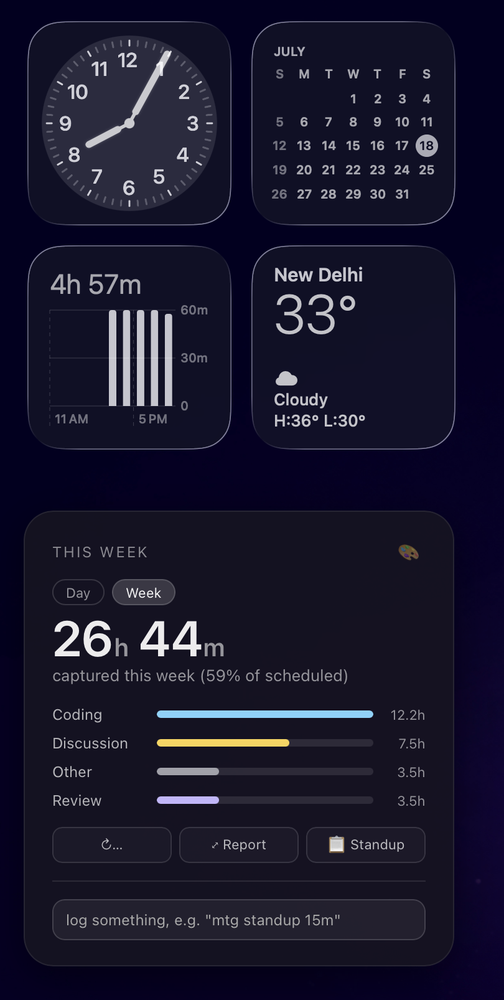
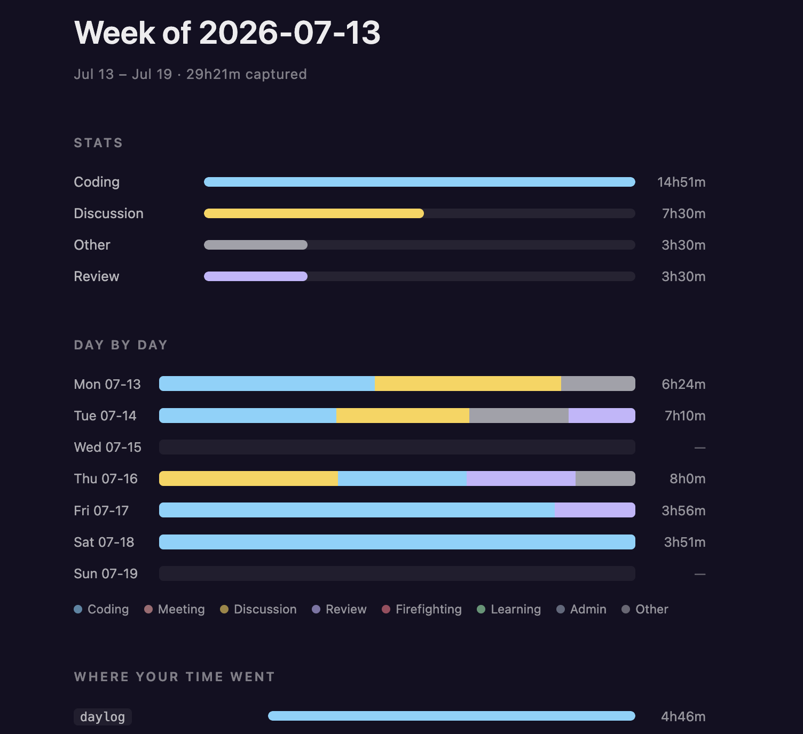
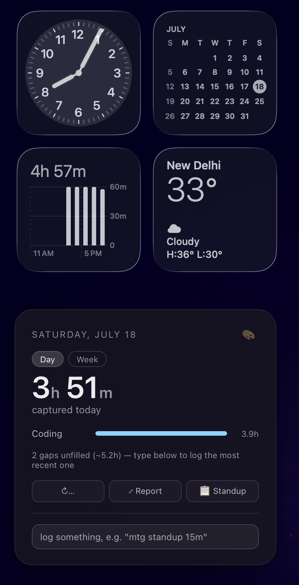

# daylog

[](https://aparajita-bits.github.io/daylog/)
[](https://github.com/aparajita-bits/daylog/actions/workflows/ci.yml)
[](LICENSE)


[](https://github.com/aparajita-bits/daylog/commits/main)
[](https://github.com/aparajita-bits/daylog/stargazers)

**Where did my day actually go?** daylog auto-logs your Claude Code
sessions, GitHub PRs, Jira/Confluence activity, and calendar meetings, then
turns all of it into an AI-polished standup, a real weekly report, and a
desktop widget — so the answer is always sitting there, instead of being
reconstructed from memory at 11am.

**No cloud. No account. No telemetry.** Everything lives in `~/.daylog/` as
plain JSONL files you own.

> If daylog saves you from an 11am standup scramble, a ⭐ helps other
> engineers find it too.

<p align="center">
  
</p>

<p align="center">
  
</p>

| | |
| --- | --- |
| 🧩 **Multi-source** | GitHub, Jira, Confluence, calendar, Claude Code, manual — one timeline |
| 🗣️ **Human standups** | `dl standup --ai` — no tool-internals, paste straight into Teams |
| 📊 **Real weekly report** | `dl view --week` — trends and completion tracking, not AI prose |
| 🖥️ **Desktop widget** | Day/Week toggle, one-click report, standup-to-clipboard |
| 🌅 **Morning brief** | Yesterday's standup in Notes.app before you open your laptop |
| ⚡ **Zero-friction** | Spotlight quick-entry, smart duration guessing |
| ✍️ **Manual is first-class** | No integration list is ever complete — 15 minutes of hallway debugging is one line, same as the big stuff |
| 🗂️ **A real worklog over time** | Months of dated, structured entries — the data's there for a 6-month review-season summary, not just today's standup |
| 🔒 **Local-first** | Plain JSONL in `~/.daylog/` — nothing optional turned on by default |

## Install

```bash
git clone <this repo>
cd daylog
./install.sh
```

That's the whole setup — installs `dl` on PATH via `pipx`, then prompts for
the optional pieces (Claude Code hooks, launchd reminders, morning-brief
poller, desktop widget). Idempotent, so `git pull && ./install.sh` just
upgrades in place. See [Install in detail](#install-in-detail) below for
the manual path and what it deliberately leaves for you to do by hand.

## Quickstart

```bash
dl log "discussed webhook retries with Priya" -d 30 -c discussion
dl jira PROJ-1234 -d 90        # shortcut: coding time against a ticket
dl day                          # today's timeline
dl standup --ai                 # yesterday + today, AI-polished, copy-paste ready
dl week                         # this week's analytics with bar charts
dl view --week                  # a full HTML report: day-by-day trend, top tickets, Jira completion
```

<p align="center">
  
</p>

## Contents

- [Why](#why)
- [Platform support](#platform-support)
- [Install in detail](#install-in-detail)
- [Feature deep-dives](#feature-deep-dives)
  - [Quick-entry interface](#quick-entry-interface-no-terminal-needed)
  - [Desktop widget](#desktop-widget)
  - [Auto-capture: Claude Code sessions](#auto-capture-claude-code-sessions)
  - [Gap-fill reminder](#gap-fill-reminder)
  - [Calendar sweep](#calendar-sweep)
  - [Evening checkpoint](#evening-checkpoint)
  - [Confluence activity](#confluence-activity)
  - [Morning brief](#morning-brief)
  - [AI-polished summaries](#ai-polished-summaries)
  - [Weekly analytics](#weekly-analytics)
  - [Full HTML report](#full-html-report)
  - [One-time backfill](#one-time-backfill)
- [Configuration](#configuration)
- [Repo layout](#repo-layout)
- [Contributing](#contributing)
- [Non-goals](#non-goals)

## Why

It's 11:00 am. Notification lights up: *"quick standup update for tomorrow?"*

You stare at the day. A PR review, a flaky-build call that ran 40 minutes
with no ticket attached, a hallway conversation explaining the auth flow
twice because the first pass didn't land. Real work — none of it written
down anywhere. Jira only knows ticket-shaped work; your calendar only knows
scheduled meetings. The rest evaporates, so the update becomes *"worked on
some stuff, a few meetings, reviewed a PR"* — true, and useless.

daylog fixes this by not asking you to track better — it stops losing the
record you're already generating. GitHub, Jira, Confluence, calendar, and
Claude Code pull in automatically; anything else is one line:
`dl log "explained the auth flow to a teammate" -d 20`. By evening, `dl
standup --ai` turns all of it into a clean update ready to paste into
Teams — not a guess reconstructed at 11am, a record.

No integration list is ever complete — there's no connector for a hallway
conversation, and there never will be. That's why manual logging isn't a
fallback bolted on as an afterthought; it's the other half of the design.
Fifteen minutes helping a teammate debug something gets the same one-line
treatment as a two-hour coding session. And because it's all just dated,
structured entries accumulating in `~/.daylog/`, daylog quietly doubles as
a worklog — six months in, the data for your review-cycle summary is
already there, day by day, not reconstructed from memory.

## Platform support

**macOS-first.** The core CLI (logging, storage, analytics, AI summaries) is
pure Python and works anywhere. But several integrations shell out to
macOS-only tooling and degrade to "does nothing, logs why" everywhere else:

| Feature | macOS | Linux/Windows |
| --- | --- | --- |
| Core CLI (`dl log`/`day`/`week`/`standup`/etc) | ✅ | ✅ |
| Claude Code session auto-capture (hooks) | ✅ | ✅ |
| GitHub/Jira/Outlook/Confluence sync | ✅ | ✅ (all via CLI/MCP, not macOS-specific) |
| Calendar sync, `eventkit` backend | ✅ (JXA + Calendar.app) | ❌ — use `outlook` backend, or skip |
| Calendar sync, `outlook` backend | ✅ | ✅ (MCP-only, no macOS dependency) |
| Desktop widget | ✅ (Übersicht) | ❌ — no widget host today |
| Morning brief → Notes.app | ✅ | ❌ — use `delivery: email` instead |
| Full HTML report (`dl view`) | ✅ | ✅ (opens in your default browser) |
| Gap-fill reminder | ✅ (launchd) | ⚠️ manual — see `reminders/daylog-cron.md` |
| Evening checkpoint / morning-brief scheduling | ✅ (launchd) | ⚠️ manual — same cron doc, adapt the commands |

If you're on Linux, the CLI itself and every MCP/CLI-based integration
(GitHub, Jira, Outlook, Confluence, and email delivery for the morning
brief) work as-is — only the JXA/Calendar.app/Notes.app/Übersicht/launchd
pieces are macOS-specific, and each has a documented workaround above.

## Install in detail

Full `install.sh` behavior: it installs `dl` permanently on PATH via `pipx`
(no venv to activate, works in every shell), then asks whether to install
the Claude Code auto-capture hooks, the launchd reminders, the
morning-brief poller, and the desktop widget (all optional, all safe to
install later). Pass `--yes` to accept the recommended default for every
prompt (except the unattended-MCP settings, which are always asked
explicitly since they're a real tradeoff, not a convenience default).

Two things it deliberately leaves to you, since they need a human in the
loop: run `dl calendar-sync` once yourself (macOS will prompt for Calendar
access), and set up the [Shortcuts.app quick-entry flow](shortcuts/README.md)
(~3 min, GUI-only, can't be scripted).

<details>
<summary>Prefer to do it by hand, or don't have <code>pipx</code>?</summary>

```bash
python3 -m venv .venv
.venv/bin/pip install -e .
export PATH="$PWD/.venv/bin:$PATH"   # or symlink `dl` onto your PATH
dl day   # should print "No entries for <today>" — you're set up
```

Then run `python3 hooks/install_hooks.py` and
`python3 reminders/install_reminders.py --load` yourself if you want those.

</details>

## Feature deep-dives

<details>
<summary><strong>Quick-entry interface (no terminal needed)</strong></summary>

### Quick-entry interface (no terminal needed)

Typing `dl log "..." -d 30 -c meeting` in a terminal is still friction. See
[shortcuts/README.md](shortcuts/README.md) for a ~3-minute one-time setup
that wires `dl quicklog` into **macOS Shortcuts**, so logging becomes:
`⌘Space` → type the shortcut name → type one line → Enter. Optionally bind it
to a global keyboard shortcut so you don't even need Spotlight.

`dl quicklog` parses everything from one free-text string —
`"mtg design review 45m"` or `"PROJ-1234 fixed pruning bug 90m"` — inferring
duration, category, and Jira key so a single text field is enough. An
explicit duration token in the text (`45m`, `1h30m`) always wins over
whatever default would otherwise apply.

</details>

<details>
<summary><strong>Desktop widget</strong></summary>

### Desktop widget

`./install.sh` prompts to set this up too. A floating desktop widget (via
[Übersicht](https://tracesof.net/uebersicht/)) that sits alongside macOS's
native Calendar/Weather widgets instead of looking like a foreign object:

<p align="center">
  
</p>

- **Day / Week toggle** — today's captured hours and category breakdown, or
  this week's totals, with a small nudge if `dl fill` would find anything
  to fill
- **🎨 background style** — cycles Dark → Frosted → Glass → Transparent,
  persisted, so it can match your setup instead of sitting as one solid
  block among the native widgets
- **↻ Reload** — force-refreshes whatever's currently showing, instead of
  waiting on the 5-minute auto refresh
- **⤢ Report** — opens the full `dl view` HTML report in your browser for
  the current period
- **📋 Standup** — copies `dl standup --ai` straight to your clipboard,
  ready to paste into Teams/Slack
- **Inline logging** — a text box that runs `dl quicklog` directly from the
  desktop, no terminal needed; while an unfilled gap is showing, the same
  box backdates your entry into that gap's time slot instead of logging it
  at "now"

See [widget/README.md](widget/README.md) for the manual setup path,
customizing colors/position, and troubleshooting.

</details>

<details>
<summary><strong>Auto-capture: Claude Code sessions</strong></summary>

### Auto-capture: Claude Code sessions

```bash
python3 hooks/install_hooks.py --dry-run   # see what it would change first
python3 hooks/install_hooks.py             # installs SessionStart + UserPromptSubmit + Stop + SessionEnd hooks
```

This merges four hooks into `~/.claude/settings.json` (backing up the
previous file first). Time is captured incrementally, not just when the
session finally ends — `Stop` fires after every turn (Claude finishing a
response), so each firing flushes that turn's active time into today's
`category: coding, source: claude-code` entry (creating it once accumulated
time crosses `claude_capture.threshold_min`, default 10 min, then topping it
up on every later turn). This means a session you keep open for days without
ever closing it still gets its time logged, split across each day it was
actually active in. Resuming a session (`claude --resume`) continues topping
up the same entry rather than forking a new one. `UserPromptSubmit` marks
the gap since the previous `Stop` as "waiting on you" and discards it if
it's over 15 min (stepped away, lunch, overnight) rather than counting it as
work; the time between a prompt landing and Claude's matching `Stop` is
always counted in full, no matter how long a turn's tool calls run.
`SessionEnd` just runs one last flush and cleans up. The entry is titled
from the project directory and a summary of your first prompt.
The hook fails silently on any error — problems go to
`~/.daylog/hook-errors.log`, never to your Claude Code session.

To remove: `python3 hooks/install_hooks.py --uninstall`.

</details>

<details>
<summary><strong>Gap-fill reminder</strong></summary>

### Gap-fill reminder

```bash
python3 reminders/install_reminders.py --load
```

Installs the `launchd` agents (writes them either way; `--load` also starts
them running):

- **17:45** — the evening checkpoint (`dl checkpoint`): calendar sweep +
  GitHub PRs (authored/reviewed/commented) + (optionally) Jira, then
  regenerates the AI summary — see [Evening checkpoint](#evening-checkpoint)
  below
- **18:00** — gap-fill reminder (`dl fill --notify`), a macOS notification
  like *"3.5 hrs captured, ~4 hrs unaccounted. Run `dl fill` to fill gaps."*
- **morning brief** (opt-in, `--morning-brief`) — polls every ~15 min, see
  [Morning brief](#morning-brief) below

Run `dl fill` any time (not just from the reminder) to see today's timeline
and fill gaps one line at a time:

```
09:00–10:30  ▓ coding      Claude Code: webhooks-service (auto)
10:30–12:00  ░ ── gap ──   (90 min)
[Enter=skip] 10:30–12:00 was: mtg design review
```

Gaps under 15 minutes are auto-ignored. On Linux, see
[reminders/daylog-cron.md](reminders/daylog-cron.md) for the cron
equivalent.

</details>

<details>
<summary><strong>Calendar sweep</strong></summary>

### Calendar sweep

`dl fill` always runs a quick calendar sync first if the calendar part of
today's 17:45 checkpoint hasn't happened yet (laptop asleep, etc — this lazy
fallback only covers calendar, not the GitHub/Jira parts of the checkpoint),
so this is optional to run by hand:

```bash
dl calendar-sync                          # today
dl calendar-sync --from 2026-07-01 --to 2026-07-07   # a range
```

Declined events, all-day events, future events, and titles matching
`calendar_sync.ignore_titles` (defaults: focus/lunch/blocker/hold) are
skipped. If a manual entry already overlaps a calendar event, the manual
entry wins — its context is richer, and the calendar event is marked
absorbed so re-syncing never duplicates it. This dedup/skip logic
(`calendar_sync.sync_day`) is backend-agnostic — both backends below feed it
the same raw event shape.

**Default backend: macOS Calendar.app** (`calendar_sync.backend: "eventkit"`)
via a small JXA script (`daylog/scripts/fetch_calendar_events.jxa`); the
first run will prompt for Calendar access permission. Declined-event
detection is best-effort (see the comment at the top of that script). This
only sees events that are actually *in* Calendar.app — if your Outlook
meetings aren't routed there (no Exchange/Internet account added in System
Settings → Internet Accounts), they won't show up here at all.

**Outlook/Microsoft 365 backend** (`calendar_sync.backend: "outlook"`) pulls
directly from Outlook via the Microsoft 365 MCP connector instead, for when
your meetings live there and aren't synced into Calendar.app. Unlike the
eventkit backend, this can't run as a plain synchronous subprocess — it's a
headless-Claude step (`.claude/commands/daylog-outlook-checkpoint.md`, same
shape as the Jira step below), run via `/daylog-outlook-checkpoint`
interactively, or unattended as part of `dl checkpoint` once you set
`checkpoint.outlook_skip_permissions: true`. **Run it interactively first**
and check the entries with `dl day` before trusting it unattended — the
exact Microsoft 365 MCP query shape needs verifying against a live session.
For historical data, `/daylog-backfill-outlook` is the range counterpart —
see [One-time backfill](#one-time-backfill). `icalBuddy` remains a
documented-but-unwired third option if neither of the above fits your setup.

</details>

<details>
<summary><strong>Evening checkpoint</strong></summary>

### Evening checkpoint

`dl checkpoint` runs at 17:45 (the same launchd slot as the calendar sweep —
it's a superset of it) and pulls three things into the log before the 18:00
gap-fill reminder fires:

```bash
dl checkpoint            # calendar + GitHub PRs (authored/reviewed/commented) + (optionally) Jira, then regenerates the AI summary
```

1. **Calendar** — same as `dl calendar-sync` (eventkit), or the Outlook
   headless step if that backend is configured.
2. **GitHub PRs** — fully automatic, no setup needed beyond an authenticated
   `gh` CLI. Logs PRs you opened, reviewed, and commented on today as
   separate entries (`category: coding`/`review`, `source: github`) — a PR
   you both opened and later commented on produces two entries, since
   they're different pieces of work. Each is keyed on `{pr_url}#{action}` so
   re-running never duplicates any one of them. Duration is a guess per
   action (`github_sync.authored_duration_min`/`review_duration_min`/
   `comment_duration_min`) and flagged `~` needs-review, same as backfilled
   Jira entries — fix with `dl edit`.
3. **Jira ticket activity** — off by default. This one needs the Atlassian
   MCP connector, and there's no one around at 17:45 to approve an MCP tool
   prompt, so by default it safely does nothing (verified: it detects the
   missing permission and stops, rather than hanging or guessing at data —
   see `~/.daylog/checkpoint.log`). To actually make it run unattended, set
   `checkpoint.jira_skip_permissions: true` in `~/.daylog/config.yaml`
   (`install.sh` offers to do this for you). This adds
   `--dangerously-skip-permissions` to that one specific headless `claude -p`
   call — only that call, not your normal interactive Claude Code sessions —
   so only enable it if you're comfortable with unattended MCP tool use on a
   timer. Prefer to review what it's about to import first? Leave this off
   and run `/daylog-backfill-jira` yourself instead.

After all three, it regenerates today's AI summary (`dl summary --ai`) so
it reflects the newly-pulled data.

</details>

<details>
<summary><strong>Confluence activity</strong></summary>

### Confluence activity

Not part of the automated checkpoint (same reasoning as Jira's off-by-default
stance — no one to approve MCP prompts unattended, and this one's less
time-sensitive than a same-day pull). Run it yourself when you want today's
Confluence activity folded in:

```
/daylog-confluence-checkpoint
```

Pulls pages you edited and pages you commented on today via the Atlassian
MCP connector, into `dl import-events --source confluence`. Entries default
to 25 minutes (edited) / 15 minutes (commented) and show a `~` marker in
`dl day`, same as backfilled Jira entries — fix with `dl edit`.

</details>

<details>
<summary><strong>Morning brief</strong></summary>

### Morning brief

Off by default; `install.sh` offers to set it up. Delivers yesterday's
AI-polished standup (same content as `dl standup --ai`, just yesterday only)
straight into **Notes.app** each morning, so it's waiting for you when you
open your laptop — no command to remember, no copy-paste.

```bash
dl morning-brief          # runs it right now, by hand
```

This doesn't fire at a fixed clock time — a launchd job polls `dl
morning-brief` roughly every 15 minutes (`reminders/com.daylog.morningbrief.plist.template`,
`StartInterval`, not `StartCalendarInterval`), and the command itself decides
whether to actually send: no-ops if already sent today, or if it's before
`morning_brief.earliest_hour` (default 6am, guards against a spurious early
wake). This means it goes out shortly after your laptop is next actually
awake, rather than possibly firing into a sleeping machine at a fixed hour.
A failed send (Notes.app scripting hiccup, network blip) isn't marked as
sent, so the next poll retries automatically rather than silently giving up
for the day.

```bash
python3 reminders/install_reminders.py --load --morning-brief   # installs the poller (still off until enabled below)
```

**Run `dl morning-brief` by hand once and check Notes.app before trusting the
unattended poller** — the Notes.app AppleScript/JXA integration
(`daylog/scripts/write_note.jxa`) needs a live check on your machine (first
run may prompt for Automation permission).

Prefer email instead of Notes? Set in `~/.daylog/config.yaml`:

```yaml
morning_brief:
  enabled: true
  delivery: email
  recipient_email: you@example.com
```

Email delivery goes through the Gmail MCP connector via the same headless-
Claude pattern as the Jira/Outlook checkpoints, so it needs
`morning_brief.email_skip_permissions: true` to actually send unattended —
same unattended-MCP-tool-use tradeoff as `checkpoint.jira_skip_permissions`,
off by default.

</details>

<details>
<summary><strong>AI-polished summaries</strong></summary>

### AI-polished summaries

```bash
dl summary            # template version, always available
dl summary --ai        # Claude-polished, falls back to template automatically
dl standup --ai        # yesterday + today, same AI polish, copy-paste ready
```

`dl summary --ai` / `dl standup --ai` shell out to headless `claude -p` with
your day's entries plus pre-computed stats (the model never does arithmetic
— Python computes every number). The prompt
(`.claude/commands/daylog-standup.md`) is written to read like a person
recalling their day, not a report generated by a script — no
"GitHub"/"Claude Code sessions" tool-internal labels leak into the output,
related entries (a PR, its review comments, the coding session that
produced it) are merged into one bullet about what actually got done, and
no time information ever appears. If Claude Code isn't installed, times
out, or fails, it silently falls back to the template version — this
command never errors out because of the AI layer. `dl fill` triggers this
automatically when you finish filling gaps, so your standup is pre-written
by morning.

`dl review --ai` (`.claude/commands/daylog-review.md`) generates
qualitative weekly pattern-spotting prose ("your Wednesdays are
meeting-heavy..."). In practice the concrete numbers in
[`dl view --week`](#full-html-report) — day-by-day trend, top tickets,
meeting load, focus blocks — turned out more useful than the narrative, so
`dl view --week` doesn't call this automatically anymore; run `dl review
--ai` directly if you still want the prose version.

</details>

<details>
<summary><strong>Weekly analytics</strong></summary>

### Weekly analytics

```bash
dl week            # this week
dl week --prev      # last week
dl week --compare   # this week vs last week deltas
```

Shows capture rate (captured vs. scheduled working hours), a category
breakdown with bar charts, top 5 work items by time, longest focus block per
day, and meeting load by weekday.

For a **day-by-day** category trend (not just one aggregated week total)
plus **Jira completion tracking** — which tickets actually closed this week
vs. were only touched — see `dl view --week` below, which renders both as a
proper HTML page. Completion tracking works by tagging entries whose Jira
sync captured a Done/Closed/Resolved-style transition
(`daylog/backfill.py::import_jira_events`, tag `jira-status:done`) — it only
covers Jira-linked work with a captured transition; daylog tracks time
spent, not task status in general, so untagged/non-Jira entries can't be
classified as done or not.

</details>

<details>
<summary><strong>Full HTML report</strong></summary>

### Full HTML report

```bash
dl view            # today: stats + AI insights
dl view --week      # this week: stats, day-by-day trend, where your time went
                     # (top tickets/projects), meeting load by weekday,
                     # longest focus block per day, and Jira completion
dl view --no-open   # write ~/.daylog/state/view.html without opening a browser
```

A properly-typeset page instead of squinting at terminal/widget output —
built for the desktop widget's Report button, but works standalone too.

The **day** view includes an AI Insights section (reuses the same prompt as
`dl standup --ai`, so it reads like a real recap, not a report). The **week**
view deliberately has no AI section — the pattern-spotting prose ("meeting-
heavy vs. deep-work days") wasn't useful in practice, and the sections above
already cover the same ground with real numbers instead of narrative, and
the page opens near-instantly since it skips the AI call entirely.

</details>

<details>
<summary><strong>One-time backfill</strong></summary>

### One-time backfill

New to daylog? Recover the last week so analytics have real data from day one:

```bash
dl backfill --days 7
```

Runs calendar backfill (only if `calendar_sync.backend` is `eventkit` — see
below if it's `outlook`), a walk of your local Claude Code session history
(`~/.claude/projects/`), and GitHub PR activity (`gh` CLI, no MCP needed)
automatically. Jira and Outlook need their MCP connectors, so they're
separate steps you run interactively inside Claude Code:

```
/daylog-backfill-jira
/daylog-backfill-outlook
```

which call `dl import-events --source jira` / `--source outlook` under the
hood. Backfilled entries needing a duration guess show a `~` marker in `dl
day` until you fix it: `dl edit <entry-id> -d 90`. Weeks containing
backfilled data show a footnote in `dl week` noting the capture rate isn't
comparable to a live-tracked week. Everything here is idempotent —
re-running `dl backfill` (or either slash command) never duplicates entries.

**Backfilling just one source for a specific range?**

```bash
dl github-sync --since 2026-07-10    # GitHub PRs updated on/after this date, each landed on its real day
dl calendar-sync --from 2026-07-10 --to 2026-07-17   # only works with the eventkit backend — see below for outlook
```

If `dl calendar-sync --from ...` reports 0 new entries and your meetings
live in Outlook, not macOS Calendar.app, that's expected — the default
`eventkit` backend only sees what's actually in Calendar.app. Switch to the
Outlook backend and use its own backfill command instead:

```yaml
# ~/.daylog/config.yaml
calendar_sync:
  backend: outlook
```

```
/daylog-backfill-outlook
```

</details>

## Configuration

Everything tunable lives in `~/.daylog/config.yaml`, created with defaults on
first run. Open it with `dl config`.

<details>
<summary><strong>Full configuration reference</strong></summary>

| Key                                           | Default                                                                   | What it does                                                                                                                                                        |
| --------------------------------------------- | ------------------------------------------------------------------------- | ------------------------------------------------------------------------------------------------------------------------------------------------------------------- |
| `categories`                                  | coding, meeting, discussion, review, firefighting, learning, admin, other | The full category list used everywhere                                                                                                                              |
| `default_duration_min`                        | 30                                                                        | Duration assumed when there's no prior entry for the day to measure elapsed time from (see below)                                                                  |
| `default_duration_min_cap`                    | 180                                                                       | Ceiling on the elapsed-time-based duration guess for manual entries (`dl log`/`dl jira`/`dl quicklog`), so a first log after a long uncaptured gap isn't absurd    |
| `claude_capture.threshold_min`                | 10                                                                        | Minimum session length to auto-capture                                                                                                                              |
| `claude_capture.ignore_dirs`                  | `[]`                                                                      | Substrings of `cwd` to never auto-capture (e.g. scratch dirs)                                                                                                       |
| `reminder.time` / `enabled`                   | 18:00 / true                                                              | When the gap-fill notification fires, and whether it's on at all                                                                                                    |
| `calendar_sync.enabled`                       | true                                                                      | Toggles calendar sync entirely                                                                                                                                      |
| `calendar_sync.backend`                       | eventkit                                                                  | `eventkit` (macOS Calendar.app, default) or `outlook` (Microsoft 365 MCP — see Calendar sweep above)                                                                |
| `calendar_sync.sync_time`                     | 17:45                                                                     | When the calendar sweep fires                                                                                                                                       |
| `calendar_sync.skip_all_day` / `skip_declined`| true / true                                                               | Skip all-day events, and events you declined                                                                                                                        |
| `calendar_sync.min_duration_min`              | 10                                                                        | Events shorter than this are skipped                                                                                                                                |
| `calendar_sync.ignore_titles`                 | focus, lunch, blocker, hold                                               | Event titles to skip                                                                                                                                                |
| `calendar_sync.dedup_tolerance_min`           | 10                                                                        | Overlap tolerance for manual/calendar dedup                                                                                                                         |
| `gapfill.min_gap_min`                         | 15                                                                        | Gaps shorter than this are auto-ignored                                                                                                                             |
| `gapfill.excluded_categories`                 | lunch, break                                                              | Extra categories accepted as gap-fill shorthand                                                                                                                     |
| `working_hours`                               | 09:00–18:00                                                               | Used for gap computation and capture rate                                                                                                                           |
| `ai_summary.enabled` / `timeout_sec`          | true / 240                                                                | Controls the headless `claude -p` call (240s because those calls consistently take 2-3 minutes end to end, not seconds)                                            |
| `github_sync.enabled`                         | true                                                                      | Toggles GitHub PR pulling (authored + reviewed + commented)                                                                                                         |
| `github_sync.authored_duration_min`           | 30                                                                        | Guessed duration for a PR you opened                                                                                                                                |
| `github_sync.review_duration_min`             | 20                                                                        | Guessed duration for a PR you reviewed                                                                                                                              |
| `github_sync.comment_duration_min`            | 10                                                                        | Guessed duration for a PR you commented on                                                                                                                          |
| `github_sync.timeout_sec`                     | 20                                                                        | Timeout for each `gh` CLI call                                                                                                                                      |
| `checkpoint.enabled`                          | true                                                                      | Toggles the whole `dl checkpoint` step (calendar + GitHub + Jira + summary)                                                                                         |
| `checkpoint.jira_timeout_sec`                 | 90                                                                        | Timeout for the headless Jira MCP call                                                                                                                              |
| `checkpoint.jira_skip_permissions`            | false                                                                     | Off = Jira pull safely no-ops unattended. True = adds `--dangerously-skip-permissions` to that one headless call so it actually runs — see Evening checkpoint above |
| `checkpoint.outlook_timeout_sec`              | 90                                                                        | Timeout for the headless Outlook MCP call                                                                                                                           |
| `checkpoint.outlook_skip_permissions`         | false                                                                     | Same as above, for the Outlook backend's headless Microsoft 365 MCP call (only runs when `calendar_sync.backend: "outlook"`)                                       |
| `morning_brief.enabled`                       | false                                                                     | Toggles the whole morning-brief feature (see Morning brief above)                                                                                                   |
| `morning_brief.delivery`                      | notes                                                                     | `notes` (Notes.app) or `email` (Gmail MCP)                                                                                                                          |
| `morning_brief.recipient_email`               | (unset)                                                                   | Required when `delivery: email`                                                                                                                                     |
| `morning_brief.earliest_hour`                 | 6                                                                         | Won't send before this local hour, even if the poller catches an early wake                                                                                        |
| `morning_brief.timeout_sec`                   | 240                                                                       | Timeout for the headless `claude -p` call that builds the digest                                                                                                    |
| `morning_brief.email_skip_permissions`        | false                                                                     | Same unattended-MCP tradeoff as `checkpoint.jira_skip_permissions`, for `delivery: email`                                                                           |

No personal data is hardcoded anywhere in the source — everything above is
config-driven, which is also why this is safe to keep in a public repo.

</details>

## Repo layout

<details>
<summary><strong>Full tree</strong></summary>

```
daylog/
├── install.sh              # one-shot setup: pipx install + hooks/reminders/widget prompts
├── daylog/                 # the CLI + all business logic
│   ├── cli.py               #   typer app, every `dl <command>`
│   ├── store.py, models.py  #   JSONL read/write, the Entry data model
│   ├── analytics.py          #   weekly stats (capture rate, top items, focus blocks, ...)
│   ├── summary.py, standup.py, review.py  #   AI/template summaries + weekly insights
│   ├── view.py               #   `dl view` — the full HTML report
│   ├── calendar_sync.py      #   eventkit + outlook calendar backends
│   ├── github_sync.py        #   GitHub PRs (authored/reviewed/commented) via `gh`
│   ├── checkpoint.py          #   the 17:45 evening sweep orchestrator
│   ├── morning_brief.py       #   the Notes.app/email morning digest
│   ├── backfill.py            #   calendar/Claude-session/Jira/Outlook/Confluence backfill
│   ├── gapfill.py, infer.py   #   `dl fill` timeline + free-text parsing
│   └── scripts/                #   JXA helpers (fetch_calendar_events.jxa, write_note.jxa)
├── hooks/                   # Claude Code SessionStart/Stop/SessionEnd hook + installer
├── reminders/               # launchd plist templates + installer, cron doc for Linux
├── shortcuts/                # macOS Shortcuts quick-entry setup guide
├── widget/                   # Übersicht desktop widget + installer
├── .claude/commands/          # /daylog-standup, /daylog-review, /daylog-checkpoint,
│                              #   /daylog-backfill-jira, /daylog-outlook-checkpoint,
│                              #   /daylog-backfill-outlook, /daylog-confluence-checkpoint
├── .github/                  # CI (pytest + ruff on every PR), issue/PR templates
└── tests/                     # fixture-driven tests for every module above
```

</details>

## Contributing

See [CONTRIBUTING.md](CONTRIBUTING.md). Short version: it's a Python CLI,
some JSONL files, and a couple of launchd agents — keep it that way, no
database, no server, no telemetry. `pytest -q` and `ruff check .` both run
in CI on every PR (`.github/workflows/ci.yml`); bug reports and feature
requests have templates under `.github/ISSUE_TEMPLATE/`.

## Non-goals

No persistent background daemon, no cloud sync, no database. (`dl
morning-brief`'s launchd job polls every ~15 min, but that's launchd
spawning and reaping a short-lived process each interval, not a resident
daemon — same category as the existing gap-fill/checkpoint schedules, just
tighter. The desktop widget is the one exception to "no GUI" from the
original plan — see [Quick-entry interface](#quick-entry-interface-no-terminal-needed)
and [Desktop widget](#desktop-widget) above for why.) See the build plan's
"Later / Ideas" section for what's still deliberately deferred
(idle-detection daemon, energy tagging, team mode, etc).

## Star History

<p align="center">
  <a href="https://star-history.com/#aparajita-bits/daylog&Date">
    <picture>
      <source media="(prefers-color-scheme: dark)" srcset="https://api.star-history.com/svg?repos=aparajita-bits/daylog&type=Date&theme=dark" />
      <source media="(prefers-color-scheme: light)" srcset="https://api.star-history.com/svg?repos=aparajita-bits/daylog&type=Date" />
      
    </picture>
  </a>
</p>
